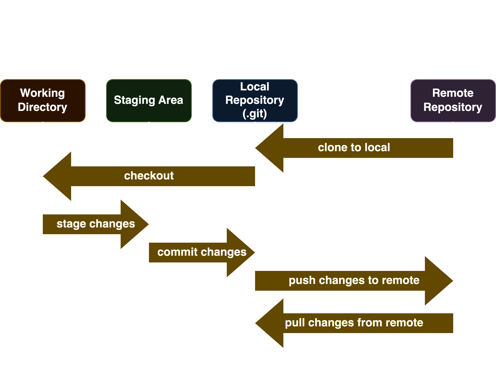

# Introduction

Git is a distributed version control system that is widely used for tracking changes in source code during software development. It allows multiple developers to work on the same project simultaneously and provides features such as branching, merging, and remote repositories.

Git thinks of its data more like a set of snapshots of a miniature filesystem. Every time you commit, or save the state of your project in Git, it basically takes a picture of what all your files look like at that moment and stores a reference to that snapshot. To be efficient, if files have not changed, Git doesn’t store the file again, just a link to the previous identical file it has already stored. Git thinks about its data more like a stream of snapshots.

## Why Git?

Here are some reasons why Git is widely used for version control:

* **Distributed**: Git is a distributed version control system, meaning that every developer has a complete copy of the project history. This allows for faster operations and better collaboration.

* **Version Control**: Git tracks every change made to your project files, allowing you to revert to previous versions if needed. This is a lifesaver if you accidentally break something or want to compare different approaches.

* **Collaboration**:  Multiple developers can work on the same project simultaneously. Git efficiently merges changes from different people, preventing conflicts and ensuring a smooth development process.

* **Branching**:  Git's branching system lets you experiment with new features or bug fixes without affecting the main project code.  You can create isolated branches, work on them independently, and then merge them back into the main branch when ready.

* **Offline Workflow**:  Most Git operations work locally on your machine. This means you can make commits and track changes even without an internet connection. Once connected, you can push your local commits to a remote repository for sharing and collaboration.

* **Security and Data Integrity**: Git uses checksums to ensure data integrity. Every change is cryptographically recorded, making it nearly impossible to lose or corrupt information.

* **Widely Adopted**:  Git is the industry standard for version control, especially in software development.  Having Git skills is a valuable asset for programmers and anyone working on collaborative projects.

## Stages of Git

- **Working Directory:** The working directory is the directory where you are currently working. It contains the actual files and folders of your project.
- **Staging Area:** The staging area is a file that stores information about what will go into your next commit. It's a simple file, maintained by Git, that stores the information about what you want to include in the next commit.
- **Local Repository:** The local repository is the .git directory that is created when you run `git init` on a new project. It contains all the changes and history of your project.
- **Remote Repository:** The remote repository is a repository that is hosted on a server. It can be accessed by multiple developers, allowing them to collaborate on a project. Remotes are typically used to share code, track changes, and synchronize work between team members.

### Flow
* To start with, you have a working directory that contains the actual files and folders of your project. This can be a new project or an existing one that you want to start tracking with Git. You can initialize a new Git repository in the current directory using the `git init` command or clone an existing repository using the `git clone` command.
* Additionally, you can checkout the code to a new or existing branch to work on a new feature or bug fix. This is done using the `git checkout` command.
* Once you make the changes you add the files and folders to the staging area. This is done using the `git add` command. The staging area is a file that stores information about what will go into your next commit.
* When you are ready to save the changes, you commit them to the local repository using the `git commit` command. This creates a snapshot of the changes and stores it in the local repository.
* To share your changes with others, you can push them to a remote repository using the `git push` command. This allows other developers to access your changes and collaborate on the project.
* Similarly, you can pull changes from a remote repository using the `git pull` command. This allows you to fetch and merge changes from the remote repository into your local repository.

## Popular Git Services

Some of the popular Git services include:

- **GitHub:** A web-based platform for version control and collaboration. It offers features such as bug tracking, task management, and wikis for every project.

- **Bitbucket:** A web-based version control repository hosting service owned by Atlassian, for source code and development projects that use either Mercurial or Git revision control systems.

- **AWS CodeCommit:** A fully-managed source control service that makes it easy for companies to host secure and highly scalable private Git repositories.

- **Azure Repos:** A set of version control tools that you can use to manage your code. It supports both centralized and distributed version control systems and is fully integrated with Azure DevOps.